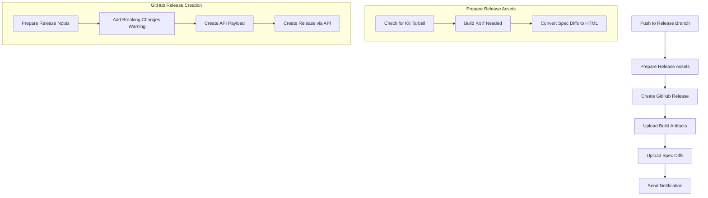
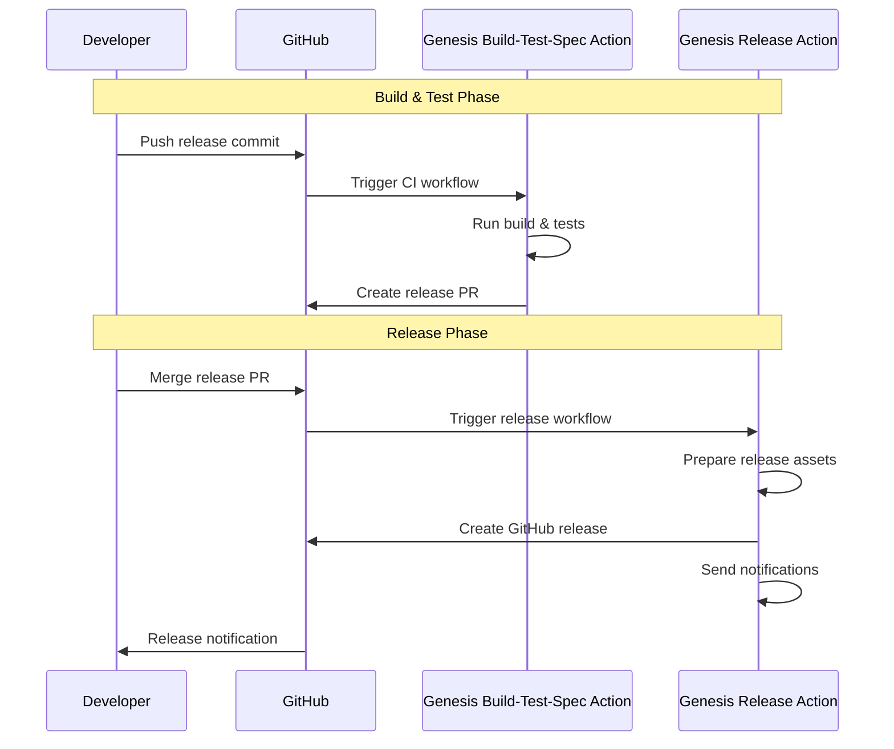
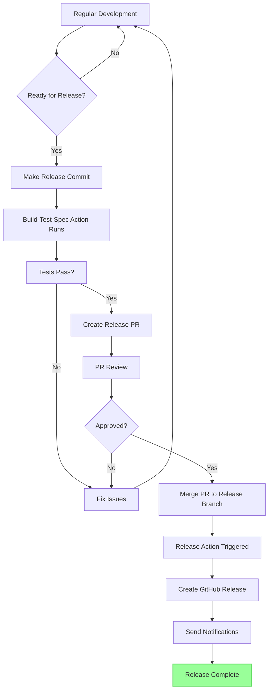

# Genesis Release Action

This GitHub Action automates the release process for Genesis kits. It focuses specifically on creating official GitHub releases with all necessary artifacts, documentation, and notifications.

## Overview

The Genesis Release Action is designed to:

1. Prepare release assets
2. Create GitHub releases
3. Upload kit tarballs and documentation
4. Send notifications about the release

## Action Workflow



## Key Components

### Release Asset Preparation

This component ensures all necessary artifacts are ready:

- Checks for kit tarballs from the build action
- Builds the kit if needed
- Converts spec diffs to HTML for better readability

### GitHub Release Creation

The core release component handles:

- Formatting release notes
- Adding warnings for breaking changes
- Creating the actual GitHub release
- Setting release properties (draft, prerelease)

### Artifact Upload

This component manages uploading all assets:

- Uploads the kit tarball
- Uploads spec diff documentation
- Ensures all artifacts are properly named and accessible

### Notification

The notification component handles communication:

- Sends release notifications to specified endpoints
- Includes release information and links
- Highlights important changes (especially breaking changes)

## Usage

```yaml
- uses: genesis-community/genesis-kit-release-action@v1
  with:
    kit_name: shield
    version: 1.2.3
    github_token: ${{ secrets.GITHUB_TOKEN }}
    # Additional configuration as needed
```

### Required Inputs

| Name | Description |
|------|-------------|
| `kit_name` | Name of the Genesis kit |
| `version` | Version number to release |
| `github_token` | GitHub token for operations |

### Optional Inputs

| Name | Description | Default |
|------|-------------|---------|
| `previous_version` | Previous version number | `0.0.0` |
| `release_notes_file` | Path to release notes file | `release-notes/release-notes.md` |
| `prerelease` | Whether this is a prerelease | `false` |
| `has_breaking_changes` | Whether breaking changes were detected | `false` |
| `spec_diffs_path` | Path to the spec diff files | `spec-check` |
| `artifact_path` | Path to the build artifacts | `build` |
| `notification_webhook` | Webhook URL for notifications | - |
| `notification_username` | Username for notification auth | - |
| `notification_password` | Password for notification auth | - |

## Integration with Genesis Build-Test-Spec Action

This action is designed to work seamlessly with the [Genesis Build-Test-Spec Action](https://github.com/genesis-community/genesis-kit-build-test-spec-action), which handles the build, test, and spec checking processes.



## The Complete Release Process

The complete Genesis kit release process involves both actions working together:



## Example Release Workflow

```yaml
name: Release

on:
  push:
    branches: ["release/**", "release/*"]
  workflow_dispatch:
    inputs:
      version:
        description: 'Version to release'
        required: true
      prerelease:
        description: 'Mark as prerelease'
        type: boolean
        default: false

jobs:
  release:
    runs-on: ubuntu-latest
    steps:
      - uses: actions/checkout@v4
        with:
          fetch-depth: 0
          
      - name: Get version from branch name
        if: github.event_name != 'workflow_dispatch'
        id: get-version
        run: |
          branch_name="${GITHUB_REF#refs/heads/}"
          version=$(echo "$branch_name" | grep -oP 'release/v?\K([0-9]+\.[0-9]+\.[0-9]+)')
          echo "version=$version" >> $GITHUB_OUTPUT
          
      - name: Download artifacts
        uses: actions/download-artifact@v4
        with:
          name: kit-build
          path: build
          
      - name: Download spec diffs
        uses: actions/download-artifact@v4
        with:
          name: spec-diffs
          path: spec-check
          
      - name: Download release notes
        uses: actions/download-artifact@v4
        with:
          name: release-notes
          path: release-notes
          
      - name: Create Release
        uses: genesis-community/genesis-kit-release-action@v1
        with:
          kit_name: your-kit-name
          version: ${{ github.event.inputs.version || steps.get-version.outputs.version }}
          prerelease: ${{ github.event.inputs.prerelease || false }}
          github_token: ${{ secrets.GITHUB_TOKEN }}
          notification_webhook: ${{ secrets.NOTIFICATION_WEBHOOK }}
          notification_username: ${{ secrets.NOTIFICATION_USERNAME }}
          notification_password: ${{ secrets.NOTIFICATION_PASSWORD }}
```

## Best Practices

### Release Branch Naming

For best results with this action, use consistent release branch naming:
- `release/vX.Y.Z`
- `release/X.Y.Z`

### Artifact Management

The action expects artifacts to be available in specific locations. Use the standard paths:
- `build/` for compiled kits
- `spec-check/` for spec difference reports
- `release-notes/` for release notes

### Notifications

For notification success:
1. Configure authentication properly
2. Use secure tokens for credential management
3. Specify topics for better organization of notifications

## License

MIT
